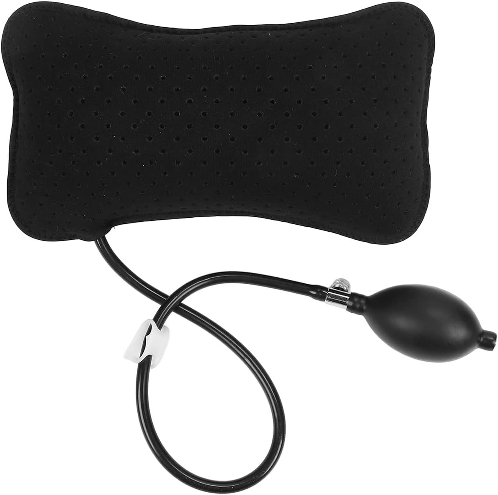

If you suffer from back pain, you can recover and eventually eliminate the pain. Depending on the issue, it can take a very long time - sometimes you see progress in just a few weeks, others it can take a year or two. And no, you probably don't need surgery. 

What you need is information. You have to understand the problem and then start making the interventions that you need to recover. This post is my attempt to help you get the information that you need, or at least to point you in the right direction of where to go next.  

Am I a physician? No. Am I a back pain specialist? No. I am just another person, just like you, who has been dealing with back pain for over a decade, and I've learned a lot about how to manage it and recover from it. I've seen dozens of specialists, read hundreds of papers, and tried countless interventions. I'm writing this post to share what I've learned, and hopefully to help you on your own journey to recovery.

# The Most Important Thing

Before I go into any more details, there is one thing that is more critical than anything in recovering from back pain, and that is to  **Stay Positive**.

This is much easier said than done, but you have to stay mentally disciplined. Don't let the challenges back pain poses get into your head, because they very easily can. Back pain can be remarkably debilitating, not just because of how incredibly intense the pain levels can be, but also because of what that pain can do to your daily life. Some of the most mundane parts of life, like getting dressed and using the bathroom, can quickly become sources of excruciating pain, and it's all too easy to let that daily experience turn into a source of depression. 

**You have to fight that.** 

Your mindset will shape your trajectory more than you think. Do NOT underestimate how important it is to focus on the gains and not the set backs.

If it helps, know that you are not alone. The CDC's 2019 [National Health Interview Survey](https://www.cdc.gov/nchs/products/databriefs/db415.htm) found that 39% of U.S. adults reported experiencing back pain in the past three months, making back pain *the single most commonly reported source of pain*. Likewise, the [2021 Global Burden of Disease Study](https://pmc.ncbi.nlm.nih.gov/articles/PMC10234592/) found that *low back pain is the leading cause of years lived with disability worldwide*. 

You don't have "bad luck" or "bad back genes". Back pain is just incredibly common. 

# How to Get Better

There's no one single path that works for everybody. The sources of back pain are many, and the prescription to recover will differ dramatically depending on your specific problem. 

What you need to do is take the time to sit down and figure out what the source of the problem is, and then start making progress towards improvement. 

## Diagnosing the Problem

Buy the [Back Mechanic book](https://www.backfitpro.com/books/back-mechanic-the-mcgill-method-to-fix-back-pain/) and read it twice through — the first time without stopping, then a second time actually doing the self-assessments the book prescribes. You will at that point have a much better picture of what is likely causing your pain, and you can come up with a plan to address it.

**This is my single best recommendation for actually understanding your pain**. The book is by [Dr. Stuart McGill](https://www.backfitpro.com/about-us/), one of the most (if not THE most) knowledgeable researchers on the topic that I have found. He dedicated his entire career to measuring the physical limits of the human body, working with and rehabilitating elite athletes from injuries. 

### Wait, shouldn't I see a doctor to diagnose the problem?

In an ideal world, there would be thousands of specialists like Dr. McGill that you could go see and do a 3 hour assessment with to really dial in what is causing your pain. 

But we don't live in that world. Instead, there are thousands of generalists and specialists who are very good at what they do, but few that are really good at **diagnosing and treating back pain**. Our medical education system just does not produce a lot of experts who entirely focus on back pain. 

That's not to say there aren't good experts out there. But there are not many of them. And even for those who really are better trained in back issues, more often than not they will not have the time to do the kind of deep dive that you need to really understand your problem. You need a 3 hour assessment, and our system is not set up to provide that.

McGill's book is your best compromise to self-diagnose and understand the mechanisms causing your pain in a way that few specialists will be able to help you with. You can get 90% of the way there with the book, and then you can use that understanding to find a specialist who can help you with the remaining 10%.

::: callout-note

McGill does train [master clinicians](https://www.backfitpro.com/backpain/master-clinician/), and you can see one of them if you can get to one...I spent 3 days visiting [Dr. Luko](https://optimal-perform.com/) in Chicago, and he has been an incredible guide in my recovery. I took a trip out to see him after reading the book and doing the self-assessment, and he was able to confirm my diagnosis and give me additional insights that I wouldn't have gotten from the book alone. If you can get to one of his master clinicians, I highly recommend it.

:::

## Modify Your Movements

Once you understand the source of the problem, you'll likely need to modify how you move throughout the day. Everything from getting out of bed, getting dressed, using the bathroom, taking a shower, picking something up off the ground...whatever it is, you have to be very intentional about how you do these everyday motions. The smallest of changes can make a big difference in how much pain you experience. 

In my case, I have bulging discs in my low back that compress my S1 nerve. Motions like bending forward allow that disc to bulge further out and cause more irritation and inflammation around the nerve, which translates to more pain. So instead, I don't bend forward to pick things up, I lunge with my legs and put more of the stress on my knees to avoid irritation in my back. 

That's just one small example, but I have completely changed how I move throughout the day, and that alone got me 50% of the way to reducing my pain levels. 

Things will feel strange at first, but eventually this just becomes second nature. You have to be very intentional about your movement, and disciplined so that you continue to avoid further irritation. McGill's book has a lot of great guidance on how to modify your movements based on your specific diagnosis.

## Walk, Walk, Walk

Walking often is one of the best treatments. Go on a 10–15 minute walk at least 3 times a day, and be serious and disciplined about it. Get some good walking shoes — Hokas are my favorite. Track your steps; the 10,000 steps a day thing is real. On days when I walk at least that far, I have a lot less pain.

This might feel counterintuitive, especially if you are in excruciating pain. But the reality is motion is better medicine than staying perfectly still. The more you can get your body moving, the better. Walking is a great way to do that without putting too much load on your spine. It gets the blood flowing, helps reduce inflammation, and builds endurance in the muscles that support your back. In contrast, laying in bed all day to avoid pain weakens all of those muscles, and when you stand up, your spine takes more of the load that your weakened muscles struggle to support.

When I had a major disc rupture last summer, I couldn't walk without crutches for about a month. Taking just 100 steps was excruciating. However, gradually I was able to increase that number, and within three months I was walking at least a mile a day. Now I'm walking close to three miles a day. It takes time, but if you can find a way to start walking more, that is going to be one of the best things you can do to get better. 

## Do the "Big Three" Exercises

The Back Mechanic introduces a set of foundational exercises known as the "Big Three" — a core stabilization routine developed by Dr. McGill. The three exercises are [bird dogs](https://www.youtube.com/watch?v=QABW99qPiNM), [side planks](https://www.youtube.com/watch?v=VAPN4CmUWqk), and [modified curl-ups](https://www.youtube.com/watch?v=_tz9WGVH25g). 

These exercises are specifically designed to strengthen the core muscles that support the spine while minimizing stress on the back. You'll learn the specifics in the book, but making these a daily habit is a cornerstone of recovery and preventing future injury. 

## Make Adjustments to Your Work Setup

In my earlier years of dealing with back pain, I built all kinds of contraptions trying to stay productive while avoiding the pain, including a [treadmill desk](https://jhelvy.weebly.com/blog/how-i-built-my-diy-treadmill-standing-desk) and [reclining desk](https://jhelvy.weebly.com/blog/v3-reclining-desk), but none worked too well — usually they made me over-work or under-work something else, putting me out of balance. 

The best thing I've found in the long run is to get a height-adjustable desk and regularly sit and stand throughout the day. Get a little kitchen timer or [Pomodoro timer](https://en.wikipedia.org/wiki/Pomodoro_Technique) and make sure you don't stay in one position for more than 20 minutes. Just alternate sitting and standing all day in 20-minute intervals.

When you do sit, make sure you have good lumbar support. I use an inflatable lumbar pillow on my chair, and it makes a big difference in keeping my spine in a good position.

And of course, make sure your monitor is at eye level, and that your keyboard and mouse are positioned so that your arms are at a comfortable angle. Ergonomics matter, and small adjustments can make a big difference in how much strain you put on your back throughout the day.

## Diet 

Your diet can have a significant impact on your back pain. Inflammation is a key driver of pain, and certain foods can either increase or decrease inflammation in the body. Focus on fruits and vegetables, lean proteins, and healthy fats. Avoid processed foods, sugary drinks, and excessive alcohol, as these can increase inflammation. This is all just basically good diet advice, anyway, but you might be surprised how much of an effect poor dietary habits can have on your back pain. 

## Sleep

Likewise, sleep is critical for recovery. Your body does a lot of its healing while you sleep, so getting enough quality sleep is essential. Aim for 7–9 hours of sleep per night, and try to maintain a consistent sleep schedule. 

If you have trouble sleeping due to pain, there are several strateiges to consider. First, try different mattresses. It's hard to know what works best until you actually give it a full night's sleep, but the answer may not be what you think. You don't always need more "support" - some people need a firmer mattress and some need a softer mattress. You have to just try different ones until you find what works.

Likewise, experiment with different sleeping positions that minimize discomfort. For many people with back pain, sleeping on their side with a pillow between their knees can help. Or sleeping on their back with a pillow under their knees can also help. The key is to find a position that keeps your spine in a neutral alignment and reduces pressure on the affected areas.

## Pain Medication

Pain medications are an important tool for managing back pain, especially during flare-ups. But they should be used judiciously and as part of a comprehensive treatment plan that includes the other strategies mentioned above.

I rely on ibuprofen for managing pain during flare-ups, but I try to use it as sparingly as possible. For example, during the day the pain level may be tolerable enough that it doesn't keep me from normal daily activities, but the pain will keep me awake at night, so I'll take it before bed to help get better sleep. Not every night, just during periods of flare ups. 

Depending on the level of severity of the pain, you might want to see a physician who could prescribe other medications that might be more effective. Gabapentin, for example, is pretty effective with nerve pain. In my case, while my core back pain resolved relatively quickly, I had a lot of residual nerve pain from nerve damage, and gabapentin was very helpful in managing that.

Despite their prevalence in pain management, I have not found opioids to be too helpful, and I would generally recommend against them except in very acute periods of intense pain. They can be effective for short-term pain relief, but they come with a high risk of addiction and other side effects, and they don't address the underlying causes of back pain. 

## Steriod Injections

Injections can be helpful for some people, especially those with specific conditions like herniated discs or spinal stenosis. They can provide temporary relief by reducing inflammation and numbing the affected area. However, they are not a long-term solution.

Where steriod injections can be really helpful is in the early stages of recovery - when you are trying to get the inflammation down and get some relief so that you can start moving more and doing exercises. They can help break the cycle of pain and inflammation, allowing you to start making progress with the other interventions.

In my case, I had two rounds of epidural steroid injections after my disc herniation last summer, and they were very helpful in reducing the inflammation and allowing me to start walking more and doing the Big Three exercises. They were not a cure, but they were instrumental in beginning the recovery process out of the very acute phase of injury.

# What Not to Do

## Don't Stretch Your Hamstrings If You Have Sciatic Pain

This one is specifically for people dealing with sciatica (pain shooting down one leg) which is a fairly common symptom of spine issues. If you have this, the sciatic nerve is already irritated and inflamed. Stretching your hamstring or calf puts that nerve under tension, which makes the inflammation worse and generates more pain, not less.

It's a very natural instinct to want to stretch a leg that feels tight or painful, and a lot of people assume that loosening the muscles will bring relief. But with an irritated sciatic nerve, that logic is backwards. Avoid any stretch that pulls on the back of the leg until the nerve has had a chance to calm down.

## Be Skeptical of Blanket Exercise Advice

There's a lot of misinformation around whole categories of exercise. A common one: "yoga is good for your back, so do more yoga." That's not always true. Whether something helps or hurts depends entirely on your specific situation, which is why diagnosing your problem first is so important.

If you're already in pain, yoga might not help, and could actually make things worse, especially if it involves movements or bends that load your spine in the wrong way. The simplest test: are you in more pain after a session? If yes, stop doing it. If no, maybe it works for you, but be careful.

I loved yoga and did it for several years, but the forward bending in particular was putting significant pressure on my L5-S1 disc, which caused more pain. The harm outweighed the benefit. The same logic applies to other popular recommendations — swimming, cycling, pilates, whatever. None of them are universally good or bad for back pain. Everything has to be evaluated against your own diagnosis and your own pain response.

## Don't Underestimate the Delayed Nature of Pain

One of the most important (and counterintuitive) things to understand about back pain is that flare-ups often have nothing to do with what you just did. When pain strikes, the instinct is to blame whatever you did a moment ago or an hour ago. But in reality, you usually need to look back *two days prior*.

Pain and inflammation are cumulative. They ramp up slowly and ramp down slowly. Do something today that irritates your spine, and you may not feel it until two days later as the inflammation builds. Start making changes to reduce inflammation, and you may not see improvement for another two or three days. Everything moves on a multi-day lag.

This means you need to think about your pain — and your recovery — on a longer timeline. Keep a mental (or written) log of what you've been doing, how you've been moving, how long you've been sitting, how much you've walked. When a flare-up hits, don't ask "what did I just do?", ask instead, "what was I doing two days ago?" And when you make a positive change, don't expect to feel it tomorrow. Give it a few days.

# FAQ

I'm finishing off this post with some common questions that I get asked a lot, and that I wish I had better answers to when I was first starting out.

## Do I Need Surgery?

In the vast majority of cases, no. Surgery is a last resort, and most people can recover without it. The key is to be patient and consistent with the non-surgical interventions. Surgery can sometimes be necessary for severe cases, like a tumor growing on your spine that can only be surgically removed, but it's important to exhaust all other options first and to get a second opinion if surgery is recommended.

I can say with confidence though that if you go to see a surgeon, they're probably going to offer you one of a series of surgeries. Not because you necessarily need it, but because that's what they do. They are trained to do surgery, and they will often recommend it as a solution. But that doesn't mean it's the right solution for you. 

Before you jump into a surgery, a great little experiment to run is what McGill calls a "virtual surgery." This is where you pick a date as your surgery date, and then from that date on, you recover as if you had done the surgery. You make all the same movement modifications, you do all the same exercises, etc. - basically you do everything that you would normally do in post-surgery recovery. Then after a few months, see how much progress you've made. If you've made significant progress, then maybe you didn't acutally need the surgery after all. Maybe all you needed was to take the dedicated time to rest and recover. 

## Should I Get an MRI?

MRIs can be helpful in some cases, but they are not always necessary. In fact, many people have bulging discs or other abnormalities on their MRI that are not actually the source of their pain. The MRI can show you what's going on in your spine, but it doesn't always tell you what is causing your pain. 

If you do get an MRI, it's important to have it interpreted by someone who is knowledgeable about back pain, and to use it as just one piece of information in your overall diagnosis. In some cases, an MRI can be helpful to rule out more serious conditions (again, tumor growing on spine type thing), but in many cases, it may not change your treatment plan. So it's not always necessary to get one, especially if you have a good understanding of your pain and a clear plan for how to address it. They're costly, and they can sometimes lead to more confusion and anxiety if they show abnormalities that may not actually be the source of your pain. 

## Will I Ever Get Better?

Yes. With the right information, the right mindset, and the right consistency, you can recover from back pain. I can promise you it will take a lot of time, probably longer than you think. Don't give up hope. The human body is incredibly resilient, and with the right approach, it can heal and recover from even severe injuries. The key is to be patient, to stay positive, and to keep making progress towards recovery, even if it's slow.

## Aren't I Too Young to Have Back Pain?

No. Back pain can affect people of all ages, and it's not uncommon for younger people to experience it, especially if they have certain risk factors like poor posture, sedentary lifestyle, or a history of injury. The key is to address it early and to take the necessary steps to manage it and prevent it from getting worse.

In fact, back is can be even more prevalent in people in their late 20s to early 40s because this is often the time of life when people are most active and putting the most strain on their backs, especially from things like having young children at home that make you move in ways that put a lot of stress on your spine. 

As you age, your discs actually harden and become less likely to bulge, which can actually reduce the risk of certain types of back pain. So while back pain can affect people of all ages, it's not necessarily more common in older adults, nor is it uncommon in younger adults. The key is to take care of your back and to address any pain or discomfort as soon as it arises, regardless of your age.

## What Happened To You?

I first started experiencing back pain in my late twenties, and it was a gradual onset. Originally, the pain was misdiagnosed as a hip issue, because the sciatic pain was wrapping around my right hip. It took me two years to discover that I actually had a bulging L5-S1 disc that was pushing on my S1 nerve. 

At the time, I didn't know what I needed to do to reduce the pain. I had never heard of McGill's book or the Big Three exercises, and I didn't understand how to modify my movements to avoid irritating the nerve. So I just kept doing what I was doing, which only made the pain worse over time. After having our first son, the pain got significantly worse as I was having to bend over a lot to pick him up, and again I didn't know that those types of motions were making things worse. 

After consulting a lot of different physicians, I ended up having a decompression surgery, which removed a small portion of my disc and some tissues around it. The surgery was a success in terms of relieving pain. After about three months of recovery, I was pain-free and thought I had finally fixed everything. For the next five years I was fine. But then in the summer of 2025, I had a major setback. 

In June 2025, I traveled for about three weeks straight to different conferences doing all the things that irritate my back - sitting on planes, eating poor quality food, not getting good sleep, not being able to exercise regularly, etc. That all culminated in an extrusion disc herniation one moring just sitting down for breakfast, right at the same disc (L5-S1) that I had surgery on. The pain was the worst I've ever experienced. I collapsed to the floor and had to call the paramedics to go to the ER as I could not get off the ground. At the ER they gave me some morphine, which helped a little bit, but I was still in excruciating pain. They did an MRI and confirmed the diagnosis of a major disc extrusion herniation. This means disc material had actually extruded out of the disc and was now sitting on top of the nerve, which is what was causing the intense pain.

The compression on my nerve was much worse than it had been before, and the nerve damage was much more severe. I had almost no control over my right foot for the first two weeks, and I had to use crutches to walk for about a month. The pain levels were so high that I was rotating between ibuprofen and tylenol every 4 hours just to be able to sleep at night.

I once again started the process of seeing lots of surgeons and doctors and trying to figure out what treatment plan I had. But the only surgery offer on the table was a spinal fusion, which I was not ready to do. So I decided to take the non-surgical route again, and I started doing the things that I should have been doing all along - modifying my movements, walking every day, doing the Big Three exercises, and being very disciplined about it.

One of the most important interventions this time was getting an epidural steroid injection just 10 days after the injury. That dramatically reduced the inflammation and allowed me to make more progress with walking and exercises.

Over the rest of the summer, I gradually made progress in reducing the inflammation and pain levels, and by the end of the summer I was able to walk a mile a day and do the Big Three exercises without too much pain. Now I'm about 9 months out from that event, and I'm walking three miles a day and doing the Big Three exercises every day, and my pain levels are down to almost zero. The nerve damage along my S1 nerve was quite extreme though, and that has caused some residual nerve pain that I still have to manage with gabapentin from time to time, but the core back pain is almost completely gone. 

I still have a long road ahead of me, and I don't know if I'll ever be 100% back to normal, but I am still seeing regular improvement in my mobility and sensation in my right leg. The key is that I have a clear understanding of what is causing the pain, and I have a disciplined approach to managing it and making progress towards recovery. I expect that the full recovery process may take another year or two, but I am hopeful that with continued consistency and patience, I will continue to see improvement over time.

# Final Thoughts

Back pain is a complex and multifaceted issue, and there is no one-size-fits-all solution. The key to recovery is to understand your specific problem, to stay positive and disciplined in your approach, and to be patient with the process. With the right information and the right mindset, you can recover from back pain and get back to living a full and active life.
