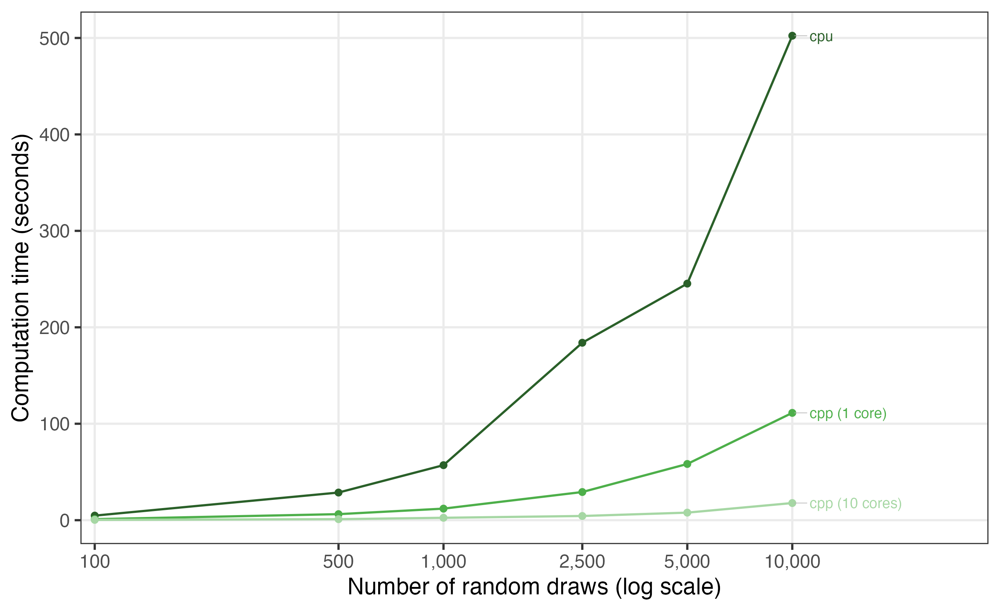
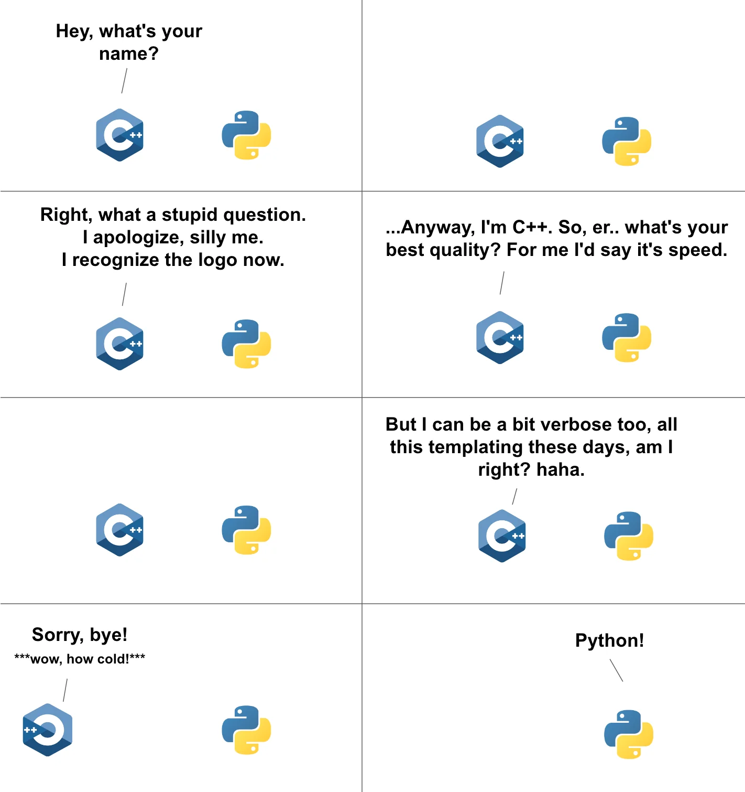

```{r}
#| label: setup
#| include: false
library(tidyverse)

info <- readRDS("data/benchmark_info_draws.rds")

# ---- Draws scaling results (logitr only) -----------------------------------
dr <- read_csv("data/runtimes_draws.csv", show_col_types = FALSE)
d <- function(cfg, nd) dr$time_sec[dr$config == cfg & dr$numDraws == nd]

cppN_lab <- grep("cores", unique(as.character(dr$config)), value = TRUE)[1]
nThreads <- as.integer(sub(".*\\(([0-9]+) cores\\).*", "\\1", cppN_lab))
maxD <- max(dr$numDraws)

cpu_max <- d("cpu", maxD)
cpp1_max <- d("cpp (1 core)", maxD)
cppN_max <- d(cppN_lab, maxD)
su1_max <- cpu_max / cpp1_max # compiled, single thread vs. R
suN_max <- cpu_max / cppN_max # compiled, all cores vs. R

# ---- Head-to-head results (all packages) -----------------------------------
rt <- read_csv("data/runtimes.csv", show_col_types = FALSE) |>
  mutate(
    pkg = sub(" .*", "", package),
    cores = as.integer(sub(".*\\(([0-9]+) cores\\).*", "\\1", package))
  )
md <- max(rt$numDraws)
mind <- min(rt$numDraws)
l1 <- rt |>
  filter(pkg == "logitr", cores == 1 | is.na(cores), numDraws == md) |>
  pull(time_sec) |>
  min()
oth <- rt |>
  filter(pkg != "logitr", numDraws == md) |>
  group_by(pkg) |>
  summarize(best = min(time_sec), .groups = "drop") |>
  mutate(x_slower = best / l1)
nOther <- nrow(oth)
minSlow <- min(oth$x_slower)
maxSlow <- max(oth$x_slower)
logitrV <- info$logitr_version

# ---- Log-likelihood stability results (10 MLHS seeds per draw count) -------
ll <- read_csv("data/loglik_draws.csv", show_col_types = FALSE)
ll_range <- ll |>
  group_by(numDraws) |>
  summarize(
    range = max(logLik) - min(logLik),
    med_time = median(time_sec),
    .groups = "drop"
  )
r50 <- ll_range$range[ll_range$numDraws == 50]
r500 <- ll_range$range[ll_range$numDraws == 500]
t500 <- ll_range$med_time[ll_range$numDraws == 500]
```

<center>

</center>

I first started writing [{logitr}](https://jhelvy.github.io/logitr/) back in 2014 as a PhD student at CMU. It started as some  files for estimating multinomial and mixed logit models in the "Willingness to Pay" (WTP) space, mostly because there weren't reliable open-source packages at the time for this, and because reviewers for my [first paper](https://www.jhelvy.com/research/2015-transportation-research-part-a-policy-and-practice/) asked for WTP space models. 

When I first wrote the various  files, speed wasn't all that important - I was just writing it to get my paper done. But I quickly realized that speed was going to be pretty important because these models require a LOT of iteration. See, WTP space models have non-convex log-likelihood functions, and they tend to bounce around a lot during estimation, often resulting in many iterations that don't converge on a solution. If you want to get a good run, you have to run a multi-start from lots of different random starting points, many of which will diverge. All that repetition translates to time, and the faster any one run goes, the more space you can search in a fixed amount of time. 

So as I started porting those files into a proper  package, I also started thinking about ways I could make the code run faster. I quickly fell into a hole of performance engineering, and the single best thing I did to speed it up was hand-derive the gradients of each and every type of model that the package supported. I also did a few smaller things around re-factoring the gradients so that large portions could be pre-computed and passed through as essentially constants. This all resulted in a pretty fast package, so fast that I wrote about some of these design choices in the [JSS paper](https://doi.org/10.18637/jss.v105.i10) I wrote about the package. By the time that paper was published (2023), {logitr} out-performed pretty much every other  package that supported mixed logit models by a considerable amount. 

Nonetheless, there was always one part of the package that I wasn't quite satisfied with: **models with a large number of random draws.**

## The slow part

[Mixed logit models](https://en.wikipedia.org/wiki/Mixed_logit) are estimated by _simulating_ the log-likelihood function. Internally, the package basically approximates an integral with a bunch of random draws, and the more draws you use, the more accurate your answer will be (at the cost of more computation). 

For example, take a look at how "normal" a normal distribution looks as you increase the number of random draws. Below I show the same true normal distribution in red and a histogram of random draws in blue for 50, 500, and 5,000 random draws:

```{r}
#| label: draws
#| fig-width: 8
#| fig-height: 3
#| fig-align: center
set.seed(42)

n_draws <- c(50, 500, 5000)

draws <- tibble(n = n_draws) |>
  mutate(x = map(n, rnorm)) |>
  unnest(x) |>
  mutate(
    n = factor(n, levels = n_draws, labels = paste(n_draws, "draws"))
  )

ggplot(draws, aes(x = x)) +
  geom_histogram(
    aes(y = after_stat(density)),
    bins = 30,
    fill = "#2c7fb8",
    color = "white"
  ) +
  stat_function(fun = dnorm, color = "#e34a33", linewidth = 0.8) +
  facet_wrap(~n, nrow = 1) +
  labs(x = "Draw value", y = "Density") +
  theme_minimal(base_size = 13) +
  theme(panel.grid.minor = element_blank())
```

In case the chart above isn't obvious enough, it turns out [we probably should be using a LOT more draws](https://doi.org/10.1016/j.jocm.2019.04.003) [Czajkowski, M., & Budziński, W. (2019). Simulation error in maximum likelihood estimation of discrete choice models. *Journal of Choice Modelling*, 31, 73-85.]{.aside} than we often do in the field of choice modeling - as many as 20,000 draws in the case of 10 or more attributes. This is a problem, because most packages use _very few_ draws (like 50-100), largely because the people who write statistical packages like these aren't computer scientists (myself included) and value other things than speed, like reproducibility and correctness. In fact, the vast majority of packages use around 50 draws by default, including {logitr} (up until now...more on that below)!

{logitr} was already faster than the other  packages people use for this, but at large draw counts it still slowed down, and it couldn't really handle the very large draw counts. When using amounts like 10,000 and up, it would crash as most computers would run out of memory. 

## The fix

One option to speed things up had been apparent to me for a few years: **GPUs**. I knew this could work because the incredible Python package [xlogit](https://xlogit.readthedocs.io/) (by the brilliant [Cristian Arteaga](https://arteagac.github.io/)) does just that. Like {logitr}, xlogit is already fast, but when you deploy it on a machine with GPUs, it can easily handle many 10s of thousands of draws. 

However, not everyone has access to GPUs, and getting something like this to work for free or low cost requires cloud platforms like Google Colab to get access to the truly fast hardware. So I didn't want to necessarily go this route. I wanted something that could still be run on a laptop / desktop, and ideally one with a multi-core CPU (as most modern machines have). 

Furthermore, {logitr} still ran entirely in , which, like Python and other higher-level languages, is terribly slow compared to C++:

<center>

</center>[[From Reddit](https://www.reddit.com/r/ProgrammerHumor/comments/w1upl0/c_talking_to_python/)]{.aside}

Changing things so that the main calculations were run in compiled C++ instead of  is something that I have seen many other packages do to achieve much higher speeds. So this too felt like the right direction to move in, but I just never did it. Adding a compiled backend to a package like this is the kind of job that's genuinely really, really challenging. I never really knew where to begin, and I never had the time to truly learn how it all works. Doing this would mean porting the log-likelihood and its analytic gradient to C++ and keep the math *exactly* right while also setting up infrastructure to confirm the results still match the  version down to the last decimal and wiring up multithreading without breaking anything. That's weeks and weeks of hard stuff, and it's very easy to get something subtly / silently wrong.

So it sat on my to-do list for years, with me secretly hoping someone else who has mastered C++ would come along and write it for me (open source ftw?).

## Doing it in two days with Claude Code

Well, no one came along to write my C++ code. But about a year ago I started using [Claude Code](https://claude.com/claude-code) to write increasingly more and more code. And now, about one year into using it, I felt confident enough to try and give this a shot. **It built everything in 48 hours.** (For those who want to know, all of the code was written with Claude Opus 4.8.)

I'm still absolutely gobsmacked that this worked at all, let alone just how fast I was able to put it all together. Here's roughly what was added, in order:

**A compiled C++ backend.** The mixed logit log-likelihood and gradient are now available as an [Rcpp](https://www.rcpp.org/) implementation, controlled by a new `backend` argument and turned on by default for mixed logit models. It produces the same results as the old  code to floating-point precision, and on its own it's about 4× faster.

**Multithreading over the draws.** On top of the compiled backend, the random draws are now processed in parallel across cores via a new `numThreads` argument. This stacks on top of the compiled speedup, and it scales with however many cores you have.

**Support for very large draw counts.** A new `numDrawsBatch` argument streams the draws in batches so that peak memory stays bounded by the batch size rather than the total number of draws. That's what makes 10,000+ draws actually feasible instead of blowing up your RAM.

**Better draws by default.** The default `drawType` is now Sobol instead of Halton (Halton sequences get correlated once you have more than about 5 random parameters), and I added Modified Latin Hypercube Sampling as a `"mlhs"` option, which tends to reach a given accuracy with fewer draws.

**Cleaner parallel multistart.** The parallelized multistart now runs on [{mirai}](https://mirai.r-lib.org/) instead of the old `mclapply`/PSOCK machinery, so there's one code path that behaves the same on every platform.

Now, you may be thinking, "Wow, that's a s#!% ton of complex code," and you would be right. But the important thing is that every one of these changes was checked against the original  implementation at each step and produced identical results. The amount of testing that went in along the way was enormous, and it accounted for probably over half of the tokens used. 

The other reason I'm rather confident in the results is that the core codebase was already hand-created and vetted over years by me. Agentic LLMs work extremely well when you point them at something that already exists. In this case, the code for the gradients (the core part used in the C++ code) was already there, so it was really just a language translation problem. LLMs are exceptionally good at that kind of task.

## The payoff

Here's the head-to-head comparison against the other  packages I benchmark against, estimating the same preference-space mixed logit model:

<center>

</center>

At `r format(md, big.mark = ",")` draws, single-threaded {logitr} finishes in about `r round(l1, 1)` seconds. The other `r nOther` packages I compared against range from roughly `r round(minSlow, 1)`× to `r round(maxSlow, 1)`× slower, and that's giving the ones that can use multiple cores their best multi-core times while {logitr} runs on a single thread. Turn on {logitr}'s own multithreading and the gap gets wider still.

But the comparison I find most fun is the one at the top of this post: how {logitr} scales as you crank up the number of draws, comparing the old  path against the new compiled backend on one core and on all `r nThreads`.

At `r format(maxD, big.mark = ",")` draws:

| Backend | Time | Speedup |
|:--|--:|--:|
|  (`cpu`) | `r round(cpu_max)` s | — |
| Compiled, 1 core | `r round(cpp1_max)` s | `r round(su1_max, 1)`× |
| Compiled, `r nThreads` cores | `r round(cppN_max, 1)` s | `r round(suN_max)`× |

The  implementation that used to be the only option takes about `r round(cpu_max / 60, 1)` minutes at `r format(maxD, big.mark = ",")` draws. The compiled backend on all `r nThreads` cores does the same work in under `r ceiling(cppN_max)` seconds, a `r round(suN_max)`× speedup. (These particular numbers are from a `r info$cores`-core Apple laptop running {logitr} `r logitrV`; the exact figures will vary by machine, but the shape of it holds.)

## So what does all this speed actually buy you? 

**More draws.** Remember, the whole reason to want more draws is that the simulated log-likelihood is an approximation, and with too few draws it gets noisy. To see just how noisy, I ran a little experiment: I estimated the same model 10 times at each of several draw counts, each time with a different set of random draws (MLHS draws, which are randomized, with every run starting from the same converged starting point). Any spread in the converged log-likelihood across those 10 runs comes from the simulation noise -- it shifts where each run lands, and with few enough draws it can even warp the likelihood surface so much that a run converges to a different local optimum entirely:

<center>

</center>

At 50 draws, the converged log-likelihood lands anywhere in a window about `r round(r50)` log-likelihood units wide, depending purely on which random draws you happen to get. That's easily enough to flip a likelihood ratio test or change which model looks "best." At 500 draws the window is about `r round(r50 / r500, 1)`× narrower, and it keeps shrinking as you add more (not perfectly monotonically -- an occasional low-draw run wanders off to another local optimum, which is the simulation noise problem in its most dramatic form).

And with the compiled backend, estimating this model with 500 draws takes just `r round(t500, 1)` seconds on my machine. So I changed the default: **{logitr} now uses `numDraws = 500`** instead of 50. The field has stuck with tiny draw counts for decades ({mlogit} and {gmnl} default to 40, Stata's `mixlogit` to 50) mostly because more draws used to be painfully slow. At these speeds, there's no longer a good reason to accept that much simulation noise.

## What _really_ made this fast to implement

I should probably take a minute to clarify how my collaboration with Claude code actually went, because I don't think "the AI did everything" is the main takeaway here, nor is it fair to myself as the core developer and the many, many  developers out there who laid the groundwork for this sort of C++ workaround for speed.

From the very beginning, I made every architectural call. I decided to keep {logitr}'s general flat data layout instead of re-tensorizing it (ala xlogit) precisely because I didn't want users to only have speed if they had access to a GPU, which few have, and also because I didn't expect the juice would be worth the squeeze. That is, we'd probably be able to get a bit faster, but requiring specialized hardware for a  stats package just feels overly complex, especially for future maintenance, and also there's already xlogit for that in python, so if you _really_ want to use a GPU, you can already with xlogit. 

Furthermore, I insisted on keeping my hand-written analytic gradients rather than swapping for a numerical approximation, which Claude code tried to do mulitple times (I'm guessing because in ML land that's the typical thing devs do?...it _really_ wanted to do this early on til I scolded it and said to knock it off and keep my analytic gradients). Finally, I also chose Rcpp over Rust for the main backend as it was easier to integrate with what was otherwise a pure  package (Rust is another common choice for  devs).

What Claude Code did was the part I had been avoiding: writing the actual C++ kernels, wiring up the threading, and building the benchmarking harness, all at a pace I could never match by hand. It also caught things I would have burned an afternoon on, like the fact that benchmarking a compiled backend under `devtools::load_all()` silently compiles it unoptimized and makes it look *slower* than the  code. When testing with a C++ backend, you actually have to `devtools::install()` the thing, and _then_ run the tests. 

Also, through every single implementation and code change, I reviewed all of it - every line. Correctness came first the whole way with careful conversations and directions, constant testing, and interogating the LLM at every step. The parity tests with the prior version of logitr are the reason that I'm comfortable making this faster backend now the default. 

Overall, it was kind of a surreal experience pulling this together in just 48 hours. The amount of work that went into this backend build out could easily have taken an entire summer, and the fact that I started on Wednesday and it's already done, documented, and tested on a Friday is just bonkers. I think we've crossed the Rubicon here with tools like Claude Code. For all the critiques of LLM systems (and there are many), I have to say, I don't think we will ever go back to writing code without them. The gain here is nothing short of extraordinary.

Another big takeaway from this experience is that **there is now no excuse for accepting lower performance when the only thing between you and that performance is code.** If the concepts are clear in your head and you have a real roadmap, then the build itself is a matter of sitting down with Claude for a day or two. Work that used to be a months-long slog now fits in a weekend, sometimes an afternoon.

## Try it

The compiled backend is in the development version of {logitr} now. Installing from source requires a C++ compiler, which is the one new wrinkle for people building from GitHub:

```{r}
#| eval: false
#| echo: true
# install.packages("remotes")
remotes::install_github("jhelvy/logitr")
```

If you use mixed logit models with a lot of draws, I'd love for you to give it a spin and let me know how it goes. And if, like me, you've been sitting on some gnarly performance project because it looked like too much of a slog, this might be a good time to take another look at it.
