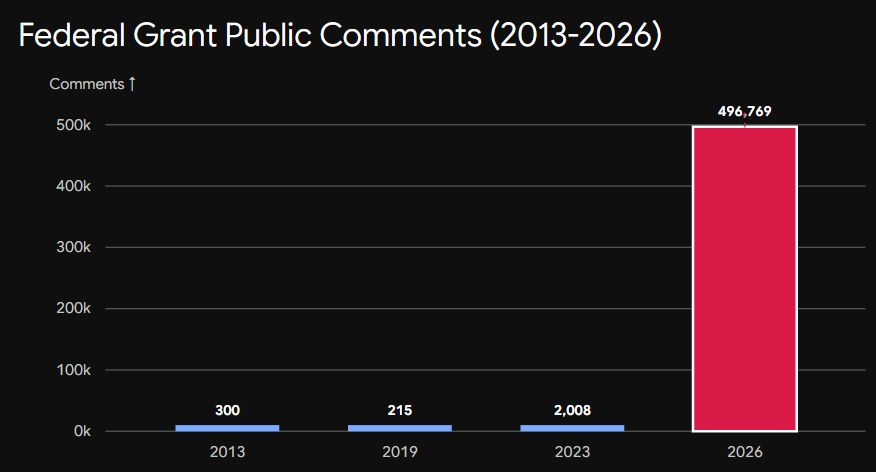
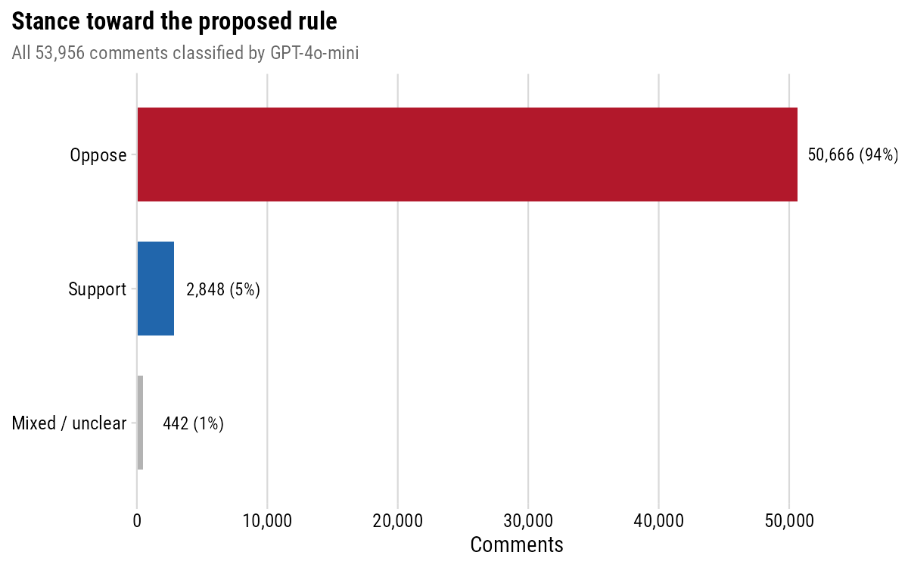
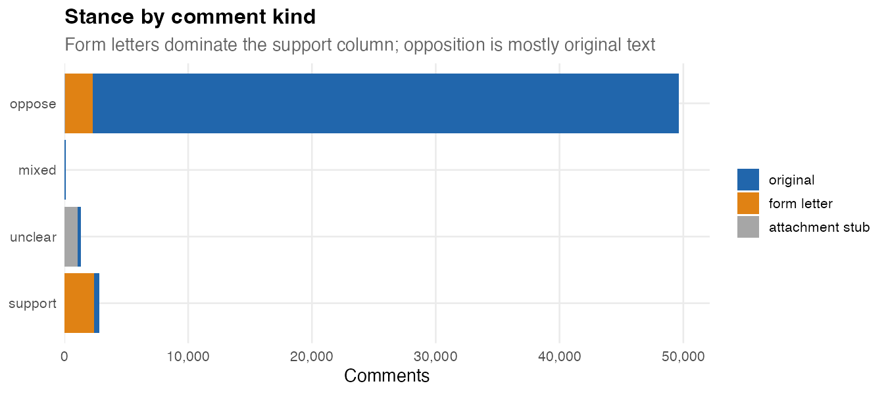
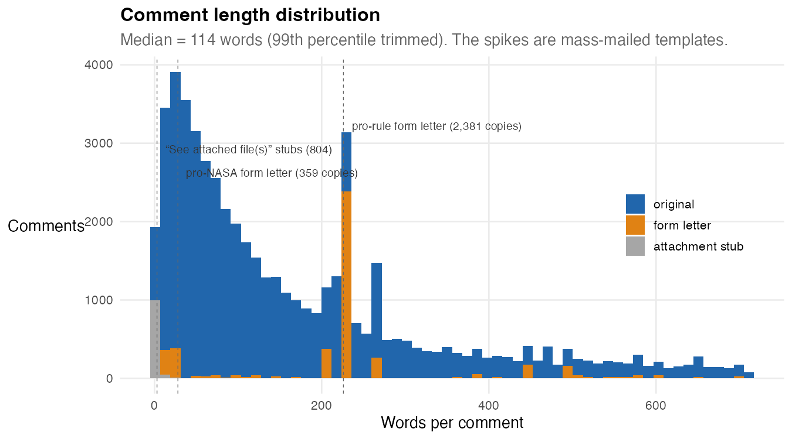
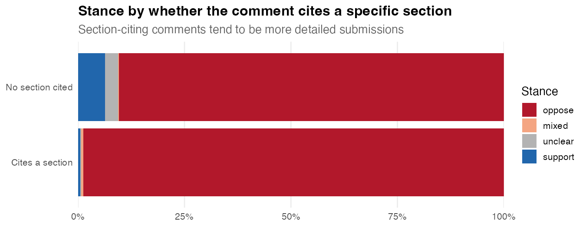
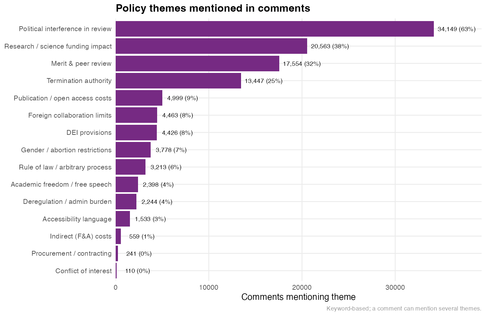
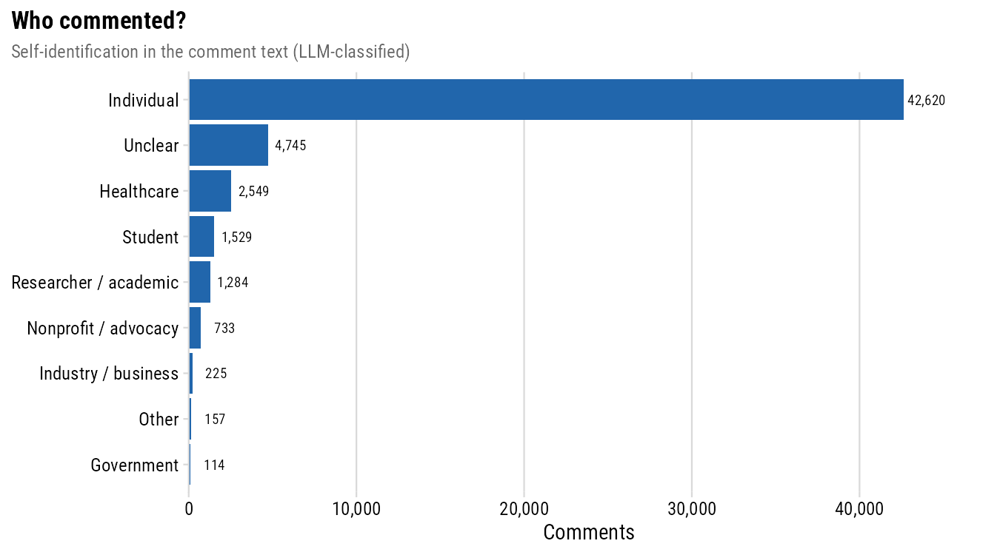
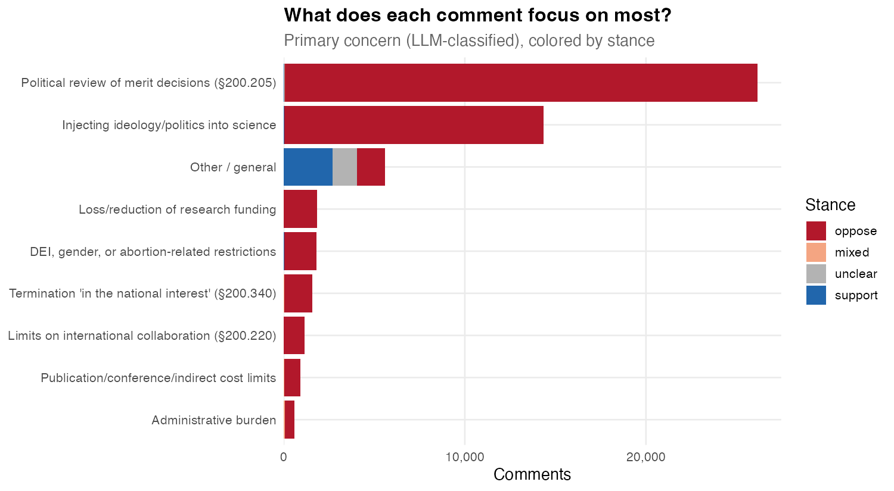

```{r}
#| label: setup
#| include: false
library(tidyverse)

stance <- read_csv("data/summary_stance.csv", show_col_types = FALSE)
sections <- read_csv(
  "data/summary_sections.csv",
  show_col_types = FALSE,
  col_types = cols(section = col_character())
)
topics <- read_csv("data/summary_topics.csv", show_col_types = FALSE)
total_n <- sum(stance$n)
s_pct <- function(k) stance$pct[stance$stance == k]
sec_pct <- function(s) sections$pct[sections$section == s]
top_pct <- function(t) topics$pct[topics$topic == t]
commenter <- read_csv("data/summary_commenter_type.csv", show_col_types = FALSE)
concern <- read_csv("data/summary_primary_concern.csv", show_col_types = FALSE)
stance_kind <- read_csv(
  "data/summary_stance_by_kind.csv",
  show_col_types = FALSE
)
support_total <- stance_kind$Total[stance_kind$stance == "support"]
support_ff <- stance_kind$`form letter`[stance_kind$stance == "support"]
support_orig <- stance_kind$original[stance_kind$stance == "support"]
oppose_orig <- stance_kind$original[stance_kind$stance == "oppose"]
oppose_ff <- stance_kind$`form letter`[stance_kind$stance == "oppose"]
pct_ff_support <- round(100 * support_ff / support_total)
fmt <- function(x) format(x, big.mark = ",")
ct_n <- function(t) commenter$n[commenter$commenter_type == t]
pc_pct <- function(t) {
  round(100 * concern$n[concern$primary_concern == t] / sum(concern$n))
}
```

In May 2026, the White House Office of Management and Budget (OMB) quietly proposed one of the most consequential changes to federal grant funding in a generation. It's a rule with a boring name: the [*Regulation for Federal Financial Assistance*](https://www.federalregister.gov/documents/2026/05/29/2026-10817/regulation-for-federal-financial-assistance). The vast majority of people have no idea about this rule or what it encompasses, but if passed as it's currently written, it will have a resounding impact on the nation as a whole and the future of all science, healthcare, technological leadership, and more in the U.S. for generations.

In addition to its impact on federal funding for state and local governments, tribes, universities, nonprofits, public authorities, school districts, healthcare organizations, small businesses, and research institutes (yes, it touches ALL of that), the rule fundamentally undermines science by putting political appointees--not experts--in charge of all federal grant making. That includes the National Science Foundation (NSF), the National Institutes of Health (NIH), all federal departments that issue research grants (Dept. of Defense, Dept. of Energy, etc.) - every single grant by *any* federal agency. Holden Thorp, Editor-in-Chief of *Science*, wrote in a June editorial titled ["Another red alert for American science"](https://www.science.org/doi/10.1126/science.aej3572) that the proposed rule would bypass congressional intent for agencies like NSF and NIH and starve federal research. The [rule does far more](https://defendfederalresearch.org/) than that, but that gives you a sense of the scope.

This post provides a detailed accounting of what people said in the public comment period from May 29 to July 13, 2026. The code for the complete anlaysis is available at [https://github.com/jhelvy/omb-grant-rule-comments](https://github.com/jhelvy/omb-grant-rule-comments).

::: {.callout-note title="TLDR"}

The response by the public is a **resounding opposition to the rule change**.

:::

## An historic response

Despite Russ Vought's efforts to minimize public comments on the ruling by allocating *only 45 days* for public comment on a ruling that affects over $1 trillion in federal assistance, the comment period drew a staggering response. The official count is 496,775 comments, though that number is likely inflated due to how comments are counted. As outlined in [this post](https://presentofcoding.substack.com/p/no-there-arent-500000-comments-on) by by Abigail Haddad and Christopher Marcum, you can inflate the official count by basically just saying that one comment represents a lot of people, so 1 comment can be made to count as 1 million comments by putting 1000000 in a box on the form...yes, it's that dumb.

{fig-align="center" width="100%"}

::: {.aside}

Image from [post by Christopher Steven Marcum](https://www.linkedin.com/feed/update/urn:li:share:7482810379866271744/)

:::

Nonetheless, the response is still historic by any measure. As of writing this on 07/18/26, **54,011 individual comments** have been released by OMB, [2,956 of which were posted since 7/13](https://www.regulations.gov/document/OMB-2026-0034-0001/comment?postedDateFrom=2026-07-13&postedDateTo=2026-07-18), the official end of the comment period, so the 54k may well be all of them. 

But even if not, reaching 54k comments is totally unprecedented in the 13-year-history of 2 CFR 200 public comments, which previously drew a mere 300, 215, and 2,008 comments in 2013, 2019, and 2023, respectively. Compared to the most-recent 2023 comment period, the 54k number is a **~2690% increase** in comments.

::: {.callout-note}

If any more comments are released, I will update this post with a complete analysis.

:::

## What the rule actually does

The proposed rule rewrites [2 CFR Part 200](https://www.ecfr.gov/current/title-2/subtitle-A/chapter-II/part-200) --- the "Uniform Guidance" that sets the ground rules for federal grants --- and the single biggest move is a change in *status*: it would convert what has long been non-binding **guidance** into binding **regulation**. On top of that reclassification, it layers in a long list of substantive changes that lawyers have written up in detail ([Holland & Knight](https://www.hklaw.com/en/insights/publications/2026/06/omb-rule-proposes-significant-changes-to-federal-financial-assistance), [Faegre Drinker](https://www.faegredrinker.com/en/insights/publications/2026/6/omb-proposes-extensive-reformation-of-federal-grant-regulations)) and that [defendfederalresearch.org](https://defendfederalresearch.org/the-rule.html) catalogs section by section. The ones that keep showing up in the comments:

- **Political review of grants before they're awarded.** Under the proposed §200.205, a senior political appointee would review every discretionary award --- each of which must "demonstrably advance the President's policy priorities" --- and could override the merit / peer-review process that agencies like NIH and NSF use to decide which science gets funded. Peer review is explicitly demoted to "advisory," and the rule bars funding tied to "anti-American values," an undefined term.
- **Discretionary termination, with no real appeal.** The proposed §200.340 would let an agency terminate a grant, in whole or in part, whenever it decides the award "no longer advances agency priorities or the national interest" (yes, the language is that vague, on purpose), plus a new 90-day "stop-work" suspension power. And under §§200.341–343, for these discretionary terminations the agency "is not required to allow for objections, hearings, and appeals" --- a recipient's only recourse is to sue in the U.S. Court of Federal Claims.
- **Ideological strings on what research can say and do.** A cluster of new provisions bars spending that promotes "theories of disparate-impact liability" (§200.218), houses an "unlawful-DEI" prohibition plus a "gender ideology" clause denying the "sex binary" and pediatric gender care (§200.300), restricts campus events by "viewpoint, content, or subject matter" even when unfunded (§200.219), and makes elective-abortion costs unallowable (§200.477).
- **New vetting of who gets funded.** The proposed §200.206 expands applicant "risk" review to cover affiliations with organizations that advocate overthrowing the government, along with a "history of questionable practices" --- a bucket broad enough to sweep in work later deemed "non-replicable" or inconsistent with "religious liberty."
- **New limits on what grant money can pay for.** Publication and open-access fees (§200.461) and conference attendance (§200.432) would each require case-by-case agency pre-approval, alongside fresh limits on professional memberships (§200.454), advertising (§200.421), and more.
- **Walls around international and domestic work.** §200.220 extends foreign-collaboration prohibitions government-wide, and a "domestic-first" framework (§200.202) makes U.S.-only entities the default for research awards, with foreign partners allowed only by senior-appointee exception. Recipients would also face mandatory E-Verify (§200.303) and English-only award materials (§200.111).

If any of that sounds like it would drastically reshape how research actually gets done in this country, well, that's more or less what the commenters think too.

## Overwhelming opposition

The headline is not subtle. Of the `r fmt(total_n)` comments I've analyzed,
**`r round(s_pct("oppose"), 1)`% oppose** the rule and just
**`r round(s_pct("support"), 1)`% support** it. The rest split between comments
that stake out a genuinely mixed position (`r round(s_pct("mixed"), 1)`%) and
ones too short or indirect to call (`r round(s_pct("unclear"), 1)`%).

::: {.aside}

We have `r fmt(total_n)` instead of the full 54,011 because 10 are withdrawn
records the site counts but never displays, 10 are stuck behind a permanent
server error on regulations.gov's end, and 35 pointed to attachments that were
restricted or unreadable.

:::

{fig-align="center" width="100%"}

If you're wondering how I managed this classification, I ran each *unique* comment text through OpenAI's GPT-4o-mini large language model (LLM), asking it to judge the stance, the kind of person writing, and the single provision the comment cares about most. To check it, I hand-labeled 300 random comments and compared notes with the model: it agreed with me on **97.7%** of them, and it never once missed a genuine support comment. I also ran a much, much simpler approach of checking for key words and phrases (e.g., "I support...", "I oppose...", etc.), and the results came out rather similar. The biggest difference where the LLM helped was in cases where the symantics matter, like statements that include mixed phrasing, e.g. "While I support efforts to reduce fraude, I oppose this measure...". Finally, other similar analyses by [techpolicy.press](https://www.techpolicy.press/the-public-rejects-ombs-federal-financial-assistance-rule/) and [Scientific American](https://www.scientificamerican.com/article/scientists-overwhelmingly-against-rule-change-that-would-give-political-appointees-say-over-science-grants/) found similar results regarding the proportion of comments that support / oppose this rule.

::: {.aside}

Each unique text is classified once and the label reused for its verbatim copies, so a form letter sent thousands of times doesn't cost thousands of API calls.

:::

::: {.callout-note title="Side note on comment attachments"}

About 1,160 comments had almost no text at all, just a line like *"see attached."* Rather than shrug those off as noise, they turned out to be where most the institutions live. I downloaded all 1,669 attached files, converted the PDFs to text, and wherever a comment simply pointed at its attachment, I treated the attachment's text as the comment, because that *is* the commenter's actual statement. That worked for 1,143 of them.

These are not casual submissions. Their median length is about **1,063 words**
--- nearly 9x the 123-word median of the docket as a whole, and they
read like formal position letters and legal memos, many from universities,
scientific societies, hospitals, and advocacy nonprofits, working through the
rule section by section. Their verdict is even more one-sided than the docket
overall: **1,085 opposed, 45 mixed, and just 3 in support**. One of the "unique"
attachments even turned out to be a form letter in disguise --- the same PDF
uploaded verbatim by 54 different commenters.

:::

## Most support is from one form letter

The already tiny support number (just `r round(s_pct("support"), 1)`% of comments) comes with a pretty big asterisk, which is that when you separate individually written comments from mass-mailed form letters, the support column nearly evaporates:

{fig-align="center" width="100%"}

Of the roughly `r fmt(support_total)` comments scored as *supporting* the rule, about **`r pct_ff_support`% are verbatim copies of a single form letter** praising the reforms as fraud prevention. Strip out the templates and count only people who wrote in their own words, and support collapses to `r fmt(support_orig)` comments --- against `r fmt(oppose_orig)` original comments opposed. 

The opposition has its templates too (`r fmt(oppose_ff)` opposing comments are form-letter copies), but they're a rounding error next to the many thousands of people who opposed the rule in their own words. Support, by contrast, is mostly one recycled letter.

You can see the templates directly in the length distribution: original comments trace a smooth curve, and the mass-mailed letters stick out of it as spikes --- the biggest being that same 2,381-copy pro-rule letter:

{fig-align="center" width="100%"}

## What people are reacting to

About 1/5th of comments cite a specific section number of the proposed rule, a share that jumped up once the attachment letters (which tend to march through the rule provision by provision) were counted. The ones that do cite sections point in a clear direction:

{fig-align="center" width="100%"}

The top two are the ones you'd expect from the summaries above: **§200.205** (political review of merit review, cited in `r round(sec_pct("200.205"))`% of comments) and **§200.340** (termination authority, `r round(sec_pct("200.340"))`%). The next batch all have to with *cost* limitations: conference costs (§200.432, `r round(sec_pct("200.432"))`%), publication and open-access fees (§200.461, `r round(sec_pct("200.461"))`%), and professional memberships (§200.454, `r round(sec_pct("200.454"))`%). Finally, a good amount also opposed restrictions on foreign collaboration (§200.220, `r round(sec_pct("200.220"))`%) and the rule's domestic-first rules (§200.202, `r round(sec_pct("200.202"))`%).

Citing a section is also a strong tell about stance. The comments that engage with the rule's actual text, including the detailed section-citing submissions, are almost uniformly opposed; what little support exists lives almost entirely in the short, no-citation comments:

{fig-align="center" width="100%"}

## Concerns by theme

Since the majority of comments did *not* mention a specific section of the rule, I wanted to still get a general sense of what people are mostly concerned about, so I matched topic keywords to produce counts by theme (a single comment can hit several themes). Again, the same story shows up in plainer language:

{fig-align="center" width="100%"}

The dominant concern is by far **political interference in the review of grants** (`r round(top_pct("political_interference"))`% of comments), followed by the broader **impact on research and science funding** (`r round(top_pct("research_science"))`%) and the fate of **merit and peer review** (`r round(top_pct("merit_peer_review"))`%). Termination authority (`r round(top_pct("termination"))`%) rounds out the top tier. The through-line across all of it is a fear that funding decisions currently made on scientific merit would become subject to political discretion.

## Who wrote in

The LLM pass also tagged how each commenter identifies themselves. The overwhelming majority are **private individuals** writing on their own behalf, not institutions:

{fig-align="center" width="100%"}

Behind that wall of individuals, the next-largest identifiable groups write from **healthcare** (`r fmt(ct_n("healthcare"))` comments), followed by **students** (`r fmt(ct_n("student"))`) and **academic researchers** (`r fmt(ct_n("researcher_academic"))`) --- the communities sitting most directly downstream of federal grant funding. Organized institutional voices are fewer in number --- `r fmt(ct_n("nonprofit_advocacy"))` advocacy organizations and nonprofits, `r fmt(ct_n("industry_business"))` businesses, `r fmt(ct_n("government"))` government commenters --- but they punch above their weight: these are disproportionately the long, formal letters that arrived as attachments, the ones that dissect the rule section by section.

## What they're most worried about

Beyond a yes/no stance, I asked the model to pick the *single* provision or theme each comment centers on. It mirrors the section and topic counts, but sharpens them to one concern per person:

{fig-align="center" width="100%"}

Two concerns tower over the rest. The most common, in about `r pc_pct("political_review")`% of classified comments, is **political review of merit decisions** --- the §200.205 provision that lets a political appointee override peer review. Close behind, roughly `r pc_pct("unscientific_ideological")`% center on the broader fear of **injecting ideology and politics into science**. Everything else --- funding cuts, termination authority, DEI and gender provisions, foreign-collaboration limits, cost restrictions --- trails well behind. The chart is colored by stance, and the pattern is hard to miss: nearly every concern, whatever its subject, is voiced in opposition.

## Caveats, and what's next

Let me restate the few caveats already mentioned, because they're important:

1. **This may still be a partial snapshot.** The comment period closed July 13, but only ~54k comments have been individually posted against an official count of ~497k. As noted above, the official count is probably inflated, but if regulations.gov releases more, I'll fold them into this post, but I couldn't expect the picture to move much.
1. **The classification is an LLM's judgment, not a census.** GPT-4o-mini agrees with my hand-labels 97.7% of the time, which is excellent, but it isn't perfect --- expect a small error rate, concentrated in the terse and genuinely ambiguous comments.
1. **Everything here is reproducible.** The scraping, attachment-extraction, consolidation, and classification code, along with the consolidated data, live in [this repo](https://github.com/jhelvy/omb-grant-rule-comments). If you want to check my work or slice it differently, please do.

Even with all those caveats, the picture is clear enough to state plainly: **the public comments on this rule are running overwhelmingly against it**. The opposition is overwhelmingly people writing in their own words, backed by long, formal letters from the universities, scientific societies, and healthcare organizations that live downstream of these grants. In contrast, the support is mostly a single recycled form letter. And the sharpest fear across sections, themes, and commenter types alike, is that political appointees will start deciding which science gets funded. 
