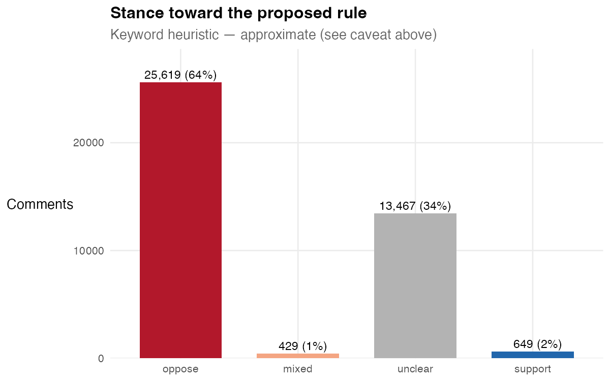
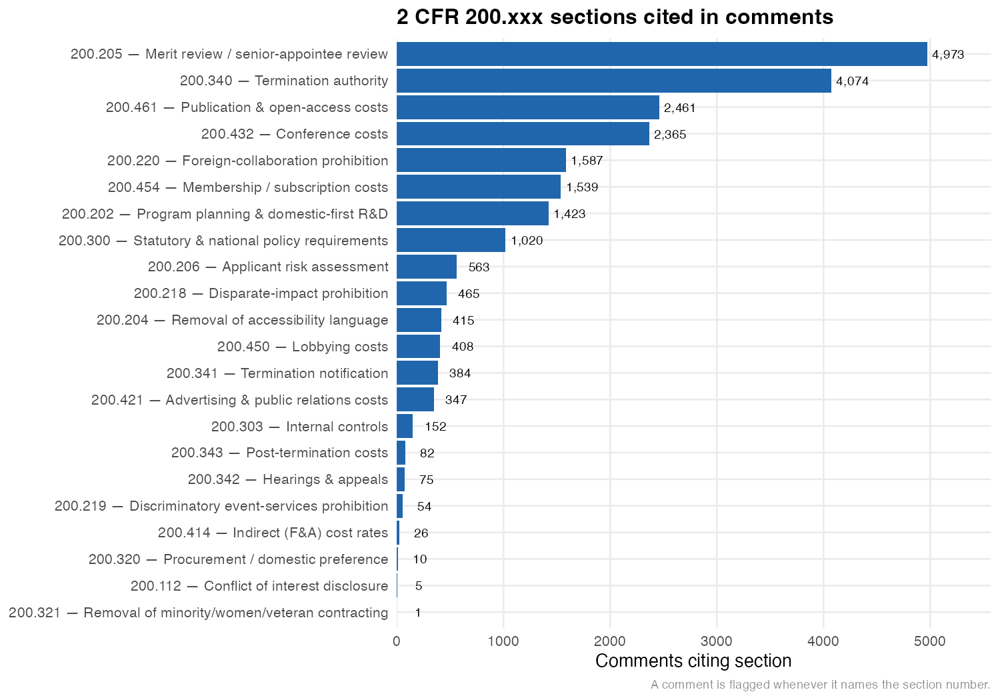
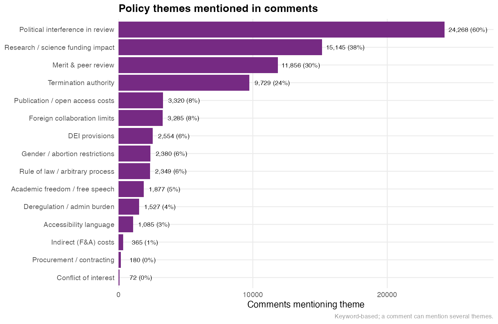

```{r}
#| label: setup
#| include: false
library(tidyverse)

stance   <- read_csv("data/summary_stance.csv", show_col_types = FALSE)
sections <- read_csv("data/summary_sections.csv", show_col_types = FALSE,
                     col_types = cols(section = col_character()))
topics   <- read_csv("data/summary_topics.csv", show_col_types = FALSE)

total_n  <- sum(stance$n)
s_pct    <- function(k) stance$pct[stance$stance == k]
sec_pct  <- function(s) sections$pct[sections$section == s]
top_pct  <- function(t) topics$pct[topics$topic == t]

fmt <- function(x) format(x, big.mark = ",")
```

Back in May, the White House Office of Management and Budget (OMB) quietly
proposed one of the most consequential changes to federal research funding in a
generation. It's a rule with a boring name --- the
[*Regulation for Federal Financial Assistance*](https://www.federalregister.gov/documents/2026/05/29/2026-10817/regulation-for-federal-financial-assistance)
--- and if you don't work with federal grants you'd be forgiven for scrolling
right past it. But it would touch essentially every grant the federal government
makes, and the research community noticed. The public comment period drew a
staggering response.

I wanted to see what people were actually *saying* in those comments, so I
downloaded them and ran some analysis. This post is a first look. Fair warning
up front: the comments are still being posted (more on that below), and my
read on them is deliberately rough-and-ready. But even the early picture is
striking.

## What the rule actually does

The proposed rule rewrites [2 CFR Part 200](https://www.ecfr.gov/current/title-2/subtitle-A/chapter-II/part-200)
--- the "Uniform Guidance" that sets the ground rules for federal grants --- and
the single biggest move is a change in *status*: it would convert what has long
been non-binding **guidance** into binding **regulation**. On top of that
reclassification, it layers in a set of substantive changes that lawyers have
written up in detail ([Holland & Knight](https://www.hklaw.com/en/insights/publications/2026/06/omb-rule-proposes-significant-changes-to-federal-financial-assistance),
[Faegre Drinker](https://www.faegredrinker.com/en/insights/publications/2026/6/omb-proposes-extensive-reformation-of-federal-grant-regulations)).
A few of the ones that show up over and over in the comments:

- **Political review of grants before they're awarded.** Under the proposed
  §200.205, a senior political appointee would review and could override the
  merit / peer-review process that agencies like NIH and NSF use to decide which
  science gets funded.
- **Discretionary termination "in the national interest."** The proposed
  §200.340 would let an agency terminate a grant, in whole or in part, whenever
  it decides the award no longer serves "agency priorities" or "the national
  interest."
- **New limits on what grant money can pay for** --- publication and open-access
  fees (§200.461), conference attendance (§200.432), professional memberships
  (§200.454) --- plus restrictions on foreign collaborations (§200.220) and a
  "domestic-first" framework for R&D.

If any of that sounds like it would reshape how research actually gets done in
this country, well, that's more or less what the commenters think too.

## A quick note on the numbers

Here's the thing you have to keep in mind for everything that follows. The
docket page reports **hundreds of thousands** of comments *received*, but
regulations.gov only posts a fraction of them individually, and it releases
them in **batches** over time. So the comments you can actually download are a
*moving, partial* slice of the whole. As I write this I've pulled
**`r fmt(total_n)`** individually-posted comments, and that number is still
climbing as more get released.[The full pipeline --- scraping, consolidating,
and this analysis --- is on [GitHub](https://github.com/jhelvy/omb-grant-rule-comments)
and is fully reproducible.]{.aside}

So treat all of this as a **snapshot**, not a final tally. I'll re-run it once
the dust settles.

## Overwhelmingly opposed

The headline is not subtle. Of the `r fmt(total_n)` comments I've analyzed so
far, roughly **`r round(s_pct("oppose"))`% read as opposed** to the rule, versus
under **`r round(s_pct("support"), 1)`% in support**. The rest didn't land
cleanly on one side of my (admittedly crude) classifier.

<center>

</center>

I should be honest about how I got that number, because it matters.[This is
exactly the kind of task a large language model would do far better than
keyword matching --- reading each comment and judging its stance. That's my
planned next step; consider these counts the fast first pass.]{.aside} I did
*not* read `r fmt(total_n)` comments. I scored stance with a keyword heuristic:
high-precision phrases that name the rule ("oppose this rule," "urge you to
withdraw"), backed up by a net count of negative-vs-positive language for the
comments that don't use an obvious phrase. It's approximate. It will
misclassify some comments, and it leaves a chunk in the "unclear" bucket
(mostly short or rhetorically indirect comments). But the direction is
unmistakable, and spot-checking the "unclear" pile turns up far more quiet
opposition than genuine neutrality --- so if anything, this *understates* how
lopsided the response is.

## Which parts of the rule people are reacting to

Only about one in six comments cites a specific section number, but the ones
that do point in a clear direction. Here's how often each section of the rule
gets named:

<center>

</center>

The top two are the ones you'd expect from the summaries above:
**§200.205** (political review of merit review, cited in
`r round(sec_pct("200.205"))`% of comments) and **§200.340** (termination
authority, `r round(sec_pct("200.340"))`%). But look at what comes next --- a
tight cluster of *cost* sections: publication and open-access fees
(§200.461), conference costs (§200.432), and professional memberships
(§200.454). Those three get cited together, at nearly identical rates, far more
than you'd expect from people writing independently. That's the fingerprint of
**organized comment campaigns** circulating shared templates that call out the
same specific provisions --- something worth digging into on its own.

## And the themes they raise

Zooming out from section numbers to themes (here I'm matching topic keywords, so
a single comment can hit several), the same story shows up in plainer language:

<center>

</center>

The dominant concern, by a wide margin, is **political interference in the
review of grants** (`r round(top_pct("political_interference"))`% of comments),
followed by the broader **impact on research and science funding**
(`r round(top_pct("research_science"))`%) and the fate of **merit and peer
review** (`r round(top_pct("merit_peer_review"))`%). Termination authority
(`r round(top_pct("termination"))`%) rounds out the top tier. The through-line
across all of it is a fear that funding decisions currently made on scientific
merit would become subject to political discretion.

## What people are saying elsewhere

<!-- TODO(JP): weave in the social-media threads / screenshots / commentary you
     mentioned here. A few things to consider dropping in:
       - notable X / Bluesky threads reacting to the rule
       - org statements or action alerts urging people to comment
       - any especially sharp individual comments worth quoting directly
     Then connect them back to what the aggregate data above shows. -->

::: {.callout-note}
This section is a placeholder --- I'll add the outside commentary I've been
collecting and tie it back to the patterns in the data.
:::

## Caveats, and what's next

Let me restate the health warnings, because they're important:

1. **This is a partial, moving snapshot.** Only a fraction of the comments
   received have been individually posted, and they're still coming in. These
   numbers will shift.
2. **Stance is a keyword heuristic, not a careful read.** It's good enough to
   see the overwhelming shape of the response, but not for precise percentages.
   Running an LLM over the full text of each comment is the obvious upgrade, and
   it's next on my list.
3. **Everything here is reproducible.** The scraping and analysis code, along
   with the consolidated data, live in
   [this repo](https://github.com/jhelvy/omb-grant-rule-comments). If you want
   to check my work or slice it differently, please do.

Even with all those caveats, the picture is clear enough to state plainly: the
public comments on this rule are running heavily against it, they're focused on
the provisions that would inject political review into the funding of science,
and a meaningful share of them are coordinated. I'll update this once the full
set of comments is available --- and once I've replaced my keyword guesses with
something that actually reads.
