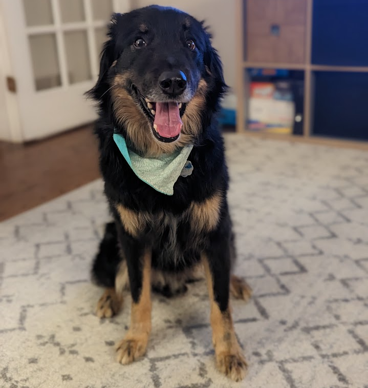

```{r setup}
source("_common.R")

year <- as.numeric(format(Sys.time(), "%Y"))
age_riley <- year - 2015
age_taki <- year - 2025
```

We have one dog, Riley, and one cat, Taki. If you found this page, you probably found our dog or cat. If you did, please call or text me at (757) 503-3500.

Thank you!

Here is a little more about out pets:

Name | Riley | Taki
---|------|------
Age | `r age_riley` years | `r age_taki` years 
Breed | English Shepherd | [Tabby cat](https://en.wikipedia.org/wiki/Tabby_cat)
Color | Black w/tan feet | Brown tabby with black stripes
Photo | {height=250px} | {height=250px} 
